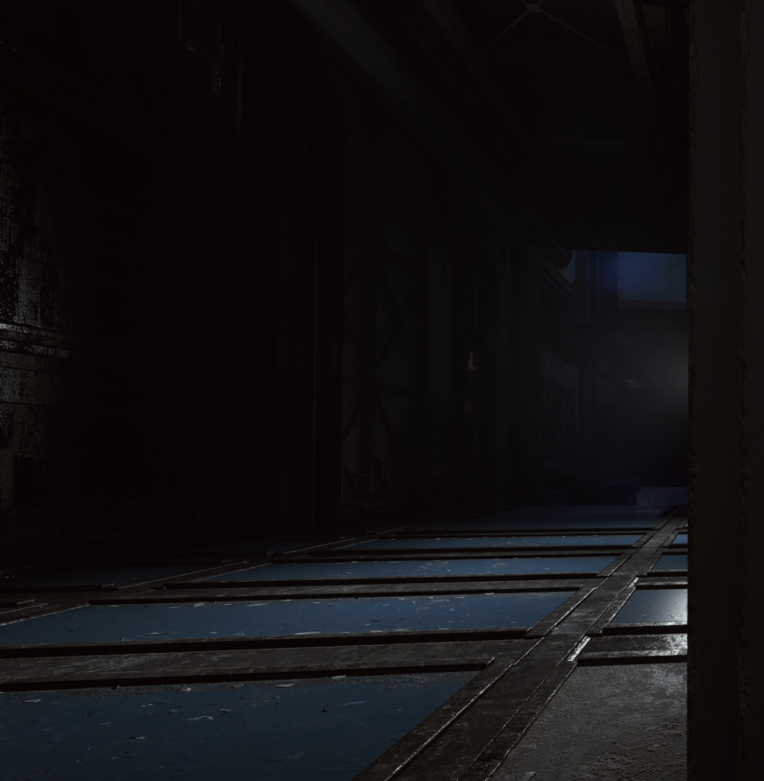
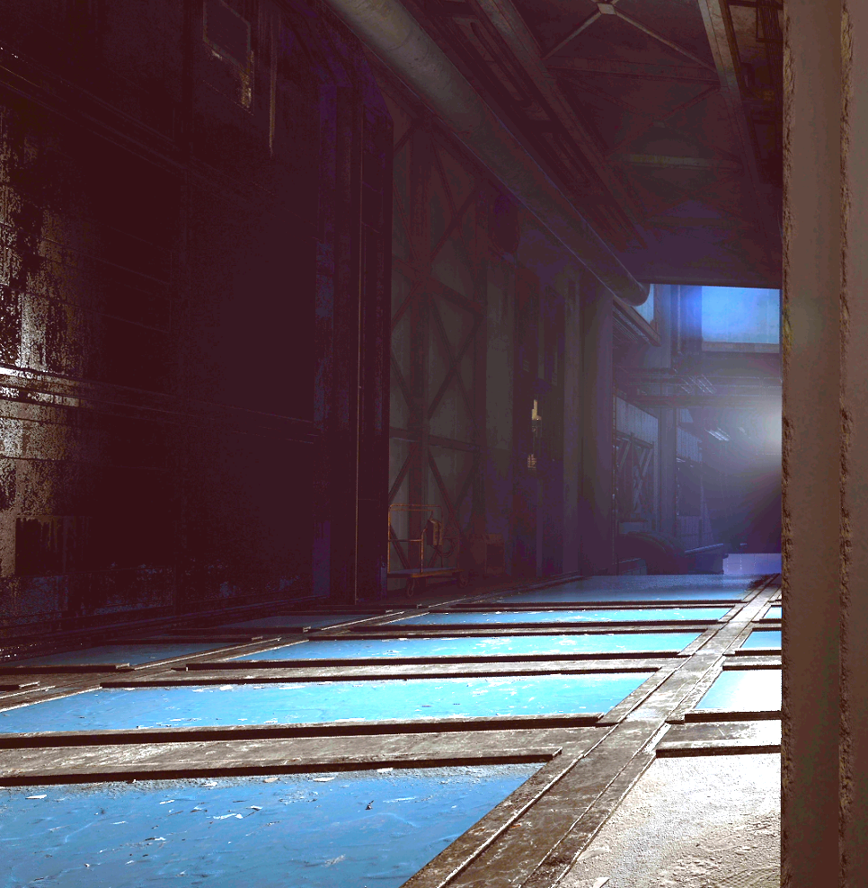

  
  
  # INTSYSTEMS | Visual Core
  
  **The ultimate hardware visual engine for gamers.**

  
  
  
   
  
  

 

## 🎯 Gain the Ultimate Advantage

Visual Core is built with one goal in mind: **Making sure you see the enemy before they see you.** By actively shifting your hardware gamma and color vibrance, pitch-black areas become completely visible without blowing out the rest of your screen.

### ✨ Key Features
* 🎛️ **Hardware Control:** Direct DDC/CI interface access for controlling brightness and contrast without ever touching your monitor's OSD menu.
* 👁️ **See in the Dark (Neural Gamma):** Advanced mathematical curve correction designed to perfectly illuminate dark corners and shadows where enemies hide.
* 🎨 **Vibrance Pop:** Custom S-Curve saturation boosting for vivid colors to help you spot player models against dull backgrounds easily.
* 💾 **Smart Profiles:** Save up to 3 custom presets for different games.
* ⚡ **Global Hotkey:** Use F10 to turn the effect on/off mid-game instantly.

---

## 🔍 See the Difference

Compare the game with Visual Core **OFF** vs **ON**.

| Visual Core OFF ❌ | Visual Core ON ✅ |
| :---: | :---: |
|  |  |
| *Pitch black corners, hard to spot enemies.* | *Enhanced shadow detail, vibrant colors.* |

---

## 🚀 Get Visual Core

Ready to unlock the full potential of your hardware instantly? 
No subscriptions. One single payment. Lifetime updates.

### 🔗 [Download & Unlock Full Version Here](https://intsystems.xyz/visualcore/)

 

  &copy; 2026 INTSYSTEMS. All rights reserved.

